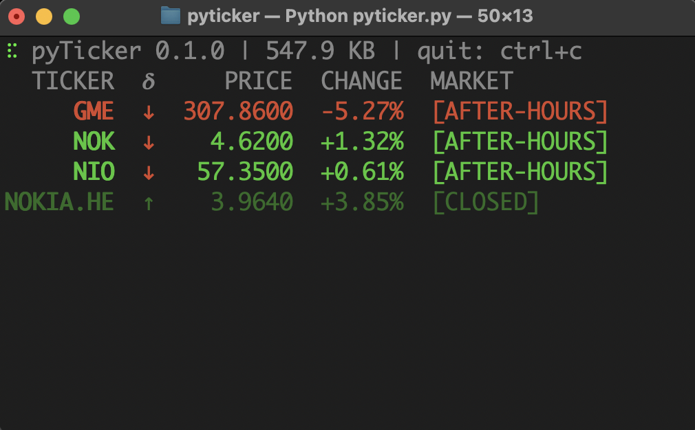

## Usage

1. `git clone https://github.com/499602D2/pyTicker`
2. `cd pyticker/pyticker`
3. `pip3 install -r requirements.txt`
4. `python3 pyticker.py`

## Issues
If your cursor disappears in the terminal:

1. Open terminal → `python3`
2. `import cursor`
3. `cursor.show()`
4. `exit()`